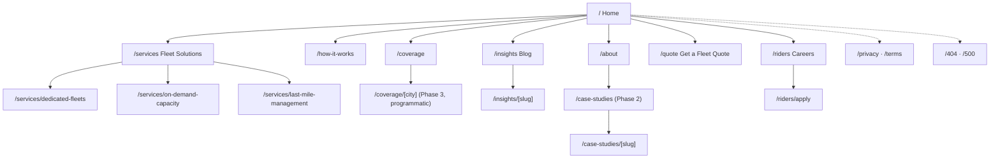
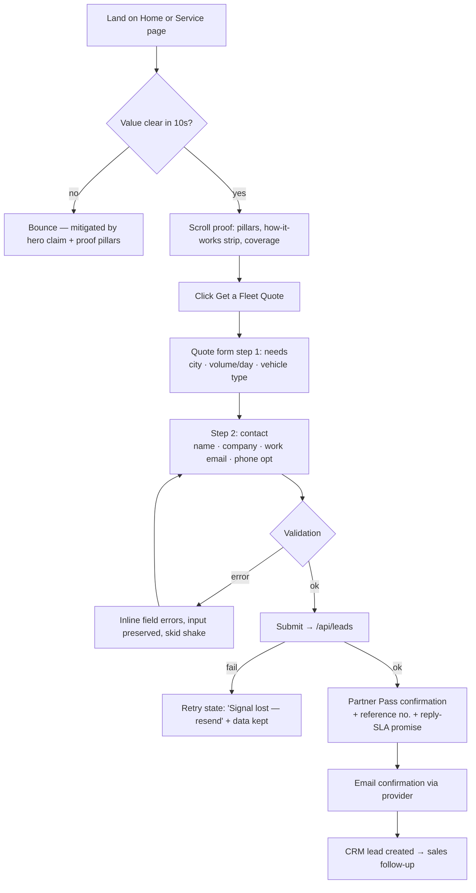

# WEBSITE MASTER SPECIFICATION (WMS)
## Proven Delivery Service — by ServHub

| | |
|---|---|
| **Document** | Website Master Specification v1.0 |
| **Project** | provendelivery.com — full marketing & lead-generation website |
| **Client** | Proven Delivery Service (PDS), a ServHub company |
| **Business model** | B2B rider-fleet-as-a-service: businesses hire PDS to supply trained, uniformed, tracked delivery riders. Secondary funnel: rider recruitment. **There is no consumer app.** |
| **Status** | ✅ v1.0 COMPLETE — all 23 sections written (see Document Map) |
| **Stack (locked)** | Next.js 15 · React · TypeScript · Tailwind CSS · GSAP · Three.js/R3F (where justified) · Framer Motion · Lenis · Lottie · Rive · shadcn/ui · Vercel |
| **Directive** | Any future AI session, designer, or developer instructed to build a page, component, or animation MUST treat this document as the single source of truth. |

### Document Map & Status

| # | Section | Part | Status |
|---|---|---|---|
| 1 | Executive Summary | 1 | ✅ Complete |
| 2 | Brand Strategy | 1 | ✅ Complete |
| 3 | Competitor Analysis | 1 | ✅ Complete |
| 4 | User Research & Personas | 2 | ✅ Complete |
| 5 | Information Architecture | 2 | ✅ Complete |
| 6 | User Flows | 2 | ✅ Complete |
| 7 | Complete Page Inventory | 4 | ✅ Complete |
| 8 | Component Library | 5 | ✅ Complete |
| 9 | Motion Bible | 3 | ✅ Complete |
| 10 | Three.js Opportunities | 3 | ✅ Complete |
| 11 | GSAP Timelines | 3 | ✅ Complete |
| 12 | Design System | 3 | ✅ Complete |
| 13 | Content Strategy | 4 | ✅ Complete |
| 14 | Technical Architecture | 6 | ✅ Complete |
| 15 | API Architecture | 6 | ✅ Complete |
| 16 | SEO Strategy | 6 | ✅ Complete |
| 17 | Accessibility | 6 | ✅ Complete |
| 18 | Performance Budget | 6 | ✅ Complete |
| 19 | Analytics | 6 | ✅ Complete |
| 20 | Security | 6 | ✅ Complete |
| 21 | QA Strategy | 7 | ✅ Complete |
| 22 | Development Roadmap | 7 | ✅ Complete |
| 23 | AI Prompt Library | 7 | ✅ Complete |

---
---

# SECTION 1 — EXECUTIVE SUMMARY

## 1.1 Project Vision

Build the definitive digital presence for Proven Delivery Service: a website that makes a logistics buyer feel the same confidence a race engineer feels looking at a well-tuned machine. The site must *prove* the brand promise — Fast. Reliable. Proven. — through its own behavior: fast to load, precise in motion, dependable in function. The website is the company's first delivery; it must arrive on time and intact.

**Rationale.** PDS sells operational trust to businesses. In B2B logistics, the website is inspected the way a warehouse is inspected — buyers infer operational quality from digital quality. A slow, generic site contradicts the product. Therefore performance, precision, and motorsport-grade polish are not aesthetic preferences; they are the sales argument.

## 1.2 Mission

Convert delivery-dependent businesses into pilot partners by communicating, within 30 seconds of arrival, exactly three things: **what PDS does** (supplies trained rider fleets as a service), **why it's safer than alternatives** (accountability: tracking, uniforms, training, SLAs), and **what to do next** (request a fleet quote). Simultaneously, recruit quality riders through a parallel funnel that never dilutes the B2B message.

## 1.3 Business Goals

| # | Goal | Description | Priority |
|---|---|---|---|
| BG-1 | Partner lead generation | Qualified B2B inquiries (fleet quotes, pilot requests) as the site's primary conversion | P0 |
| BG-2 | Rider recruitment | Steady applicant pipeline to scale fleet supply with demand | P0 |
| BG-3 | Category credibility | Position PDS as the *professional* alternative to gig marketplaces before launch scale exists | P1 |
| BG-4 | Sales enablement | Site pages double as sales-call artifacts (services, SLAs, coverage) the team can send to prospects | P1 |
| BG-5 | SEO foundation | Own "delivery riders for business," "last-mile fleet outsourcing" and city-level variants within 12 months | P2 |
| BG-6 | Brand asset | An Awwwards-caliber experience that earns press, backlinks, and inbound attention disproportionate to company size | P2 |

## 1.4 Brand Goals

1. Every screen must be attributable to the PDS brand kit within one second (black world, green energy, forward-leaning type, rider/speedometer motifs).
2. Motion must express *controlled speed* — never chaos, never floatiness. The brand is a professional rider, not a stunt rider.
3. The speedometer hidden in the wordmark's "O" is the brand's signature device; the site should deploy it as a recurring functional element (progress, loading, telemetry), not decoration.
4. The dual audience (business buyers / riders) shares one brand but gets two voices: buyers hear *accountability*; riders hear *respect and pride*.

## 1.5 User Goals

| Audience | Primary goal on site | Secondary goals |
|---|---|---|
| **Operations / logistics manager** (buyer) | Understand the service model and get a quote fast | Verify coverage area, SLAs, pricing logic, proof of professionalism |
| **Founder / e-commerce owner** (buyer) | Judge whether PDS can scale with them | Compare vs. gig platforms, see onboarding effort, talk to a human |
| **Prospective rider** | Apply in under 3 minutes from a phone | Understand pay, gear, training, schedule respect |
| **Press / partners / investors** | Grasp the company story quickly | Find brand assets and contact |

## 1.6 Success Metrics & KPIs

| KPI | Target (90 days post-launch) | Measurement |
|---|---|---|
| Partner inquiry conversion rate | ≥ 3.0% of unique visitors on buyer pages | Analytics funnel (Section 19) |
| Rider application completion rate | ≥ 55% of application starts | Form funnel events |
| Lighthouse (mobile, all core pages) | ≥ 95 Performance / 100 A11y / 100 SEO | CI check per deploy (Section 18/21) |
| LCP / CLS / INP | ≤ 2.0s / ≤ 0.05 / ≤ 200ms at p75 | CrUX + Vercel Analytics |
| Organic impressions for money keywords | Top-20 rankings on 5 target terms | Search Console |
| Qualified-lead rate (sales-accepted) | ≥ 40% of inquiries | CRM feedback loop |
| Bounce rate, buyer landing pages | ≤ 45% | Analytics |
| Time-to-quote-form (median) | ≤ 90s from landing | Custom event timing |

## 1.7 Long-Term Roadmap (Website)

| Phase | Scope | Trigger |
|---|---|---|
| **0 — Ignition** (live) | Coming-soon experience (already built): countdown, partner/rider capture | Pre-launch |
| **1 — Launch** | Full marketing site: Home, Services, Coverage, Riders, About, Contact/Quote, legal | Launch day |
| **2 — Proof** | Case studies, testimonials, live network stats ("parcels delivered" telemetry), blog/insights | First 5 partners live |
| **3 — Scale** | City landing pages (programmatic SEO), partner portal login (SLA reports, invoices), rider portal | 3+ cities, recurring clients |
| **4 — Platform** | Instant quote calculator with live pricing, API docs for enterprise integrations | Product maturity |

**Rationale.** Phasing prevents the classic pre-launch trap: building portal features before there are users. Phases 0–1 sell; Phase 2 proves; Phases 3–4 compound. The architecture (Section 14) must anticipate Phases 3–4 (auth-ready, CMS-driven, i18n-capable) without building them prematurely.

---

# SECTION 2 — BRAND STRATEGY

## 2.1 Brand Personality

Five-dimension profile (each 1–10, with the behavioral implication for the website):

| Dimension | Score | Web implication |
|---|---|---|
| **Competence** | 10 | Zero jank tolerance. Numbers, SLAs, and telemetry-style UI elements. Errors handled gracefully. |
| **Excitement** | 8 | Motorsport energy: speed streaks, ignition moments, kinetic type — always resolved with control. |
| **Ruggedness** | 6 | Matte textures, gear/helmet imagery, road vernacular. Never grunge or distressed. |
| **Sophistication** | 7 | Premium restraint: one accent color, generous space, cinematic pacing. |
| **Sincerity** | 7 | Plain-spoken promises with consequences ("If it moves with us, we answer for it"). No logistics jargon walls. |

**Archetype:** *The Professional Racer* — a hybrid of Hero (delivers under pressure) and Ruler (systems, standards, accountability). Not the Outlaw (gig-economy chaos) and not the Everyman (commodity courier).

## 2.2 Visual Language

Derived directly from the brand kit and its mockups (billboards, packaging, rider gear, stationery):

- **The world is black.** `#0D0D0D` fields dominate ≥80% of any viewport. Elevation is achieved with near-black layers (`#141414`, `#181818`) and *light*, never gray gradients or heavy shadows.
- **Green is ignition.** `#6CC04A` is reserved for energy: CTAs, progress, live states, streaks, the speedometer needle, one emphasized word per headline. Rule of thumb: if a viewport is more than ~10% green, it is off-brand.
- **White is the voice.** All reading content is white with opacity steps (100/70/40%) for hierarchy.
- **Motifs (use functionally, not decoratively):** speed streaks (motion, transitions, dividers), the speedometer (progress, loading, stats), the rider mark (brand presence, wayfinding, success states), map pins & routes (coverage, timelines), green packing tape (card/section accents, from the packaging system), halftone dot fades (texture, from packaging), night-city silhouettes (depth backgrounds).
- **Forward lean.** The italic wordmark establishes a rightward vector; compositions, entrances, and streaks should travel left→right. The brand only moves forward.

## 2.3 Tone of Voice

**Voice formula:** *Racing-team radio meets operations manual* — short, declarative, confident, concrete. Tagline cadence ("Fast. Reliable. Proven.") is the rhythmic signature: sequences of three, hard stops.

| Principle | Do | Don't |
|---|---|---|
| Declarative | "We supply the fleet. You keep the customer." | "We aim to provide comprehensive delivery solutions." |
| Concrete | "Uniformed riders. Live tracking. One invoice." | "End-to-end synergistic logistics ecosystems." |
| Accountable | "If it moves with us, we answer for it." | "We are not liable for…" (in marketing copy) |
| Respectful to riders | "Routes that respect your time." | "Hustle harder. Earn more." (gig-speak) |
| Three-beat rhythm | "Trained. Tracked. On time." | Long comma-chained sentences |

**Voice by audience:** Buyers = accountability and control ("your routes," "your SLA," "your dashboard"). Riders = pride and fairness ("real gear," "fair pay," "ride with the best"). Same brand, different pronouns and stakes.

## 2.4 Messaging Architecture

- **Category claim:** Rider fleets as a service.
- **Primary value proposition (buyers):** *Put Proven riders on your routes — trained, uniformed, tracked, and accountable, without building a fleet yourself.*
- **Primary value proposition (riders):** *Ride with the best — fair pay, real gear, real training, schedules that respect your time.*
- **Proof pillars (from kit, reframed B2B):** Real-Time Tracking (your ops team sees everything) · Secure Deliveries (sealed, verified, intact) · 24/7 Support (a human answers) · Nationwide Coverage (one partner, every region).
- **Taglines:** "Fast. Reliable. Proven." (signature) · "Delivering Excellence, Every Mile. On Time. Every Time." (long-form) — deploy verbatim; never paraphrase them into mush.
- **Message hierarchy per page:** 1 category claim → 1 value prop → max 4 proof pillars → 1 CTA. Never more.

## 2.5 Color Psychology

| Color | Hex | Kit meaning | Psychological function on site |
|---|---|---|---|
| Primary Green | `#6CC04A` | Growth, Energy, Trust | "Go" signal: motion, live status, action. Green = the system is running. Its scarcity makes every CTA feel like a lit ignition switch. |
| Deep Black | `#0D0D0D` | Strength, Elegance, Professionalism | The night road: focus, premium calm, makes green luminous. Signals confidence (consumer couriers fear dark UIs; PDS doesn't). |
| White | `#FFFFFF` | Clarity, Simplicity, Balance | Legibility and honesty; opacity as hierarchy avoids introducing grays that would muddy the triad. |

**Extended functional tokens** (defined fully in Section 12): success = Primary Green; warning/error must NOT introduce red/amber arbitrarily — errors use white text + shake/skid motion + icon, destructive confirmations may use a desaturated signal tone specified in the design system, keeping the triad pure in marketing surfaces.

## 2.6 Typography

- **Display (headlines, numerals):** the custom bold-italic wordmark style; web substitute locked in Section 12 (extended-width grotesque, weight 800–900, italic, uppercase, tight tracking, line-height ≤1.0). The lean is mandatory — upright display type is off-brand.
- **Utility (labels, taglines, nav, data):** Montserrat Medium/SemiBold, uppercase, +10–14% letter-spacing — the kit's tagline treatment. This is the "precision instrument" register: telemetry, chips, table headers.
- **Body:** Montserrat Regular 16–18px, sentence case, line-height 1.6, white 70%.
- **Numerals:** tabular figures everywhere data lives (counters, SLAs, pricing) — jittering numbers read as unreliable.

## 2.7 Photography Direction

- **Subjects:** riders in PDS gear (helmets, green-piped jackets), fleets staged like race grids, packages with green tape, night-city routes, ops rooms with tracking screens.
- **Grade:** low-key, high contrast, deep blacks, controlled green practical light (headlights, screens, signage). Cool shadows, no lifestyle warmth filters.
- **Composition:** forward motion left→right; shallow depth on gear details; motion blur only on backgrounds, subject tack-sharp (controlled speed).
- **Never:** stock smiling-courier-at-door clichés, daylight suburbia, visible competitor liveries, unbranded helmets.

## 2.8 Illustration & Iconography

- **Illustration:** flat, geometric, single-weight — extensions of the rider mark's vocabulary (streaks, pins, routes, gauges). Used for diagrams (how it works, coverage) where photography can't yet exist pre-scale. No 3D clay mascots, no gradient blobs.
- **Iconography:** 1.6px stroke, rounded caps, 24px grid, white default / green active. Canon set: radar-ping (tracking), shield-check (security), headset (support), route-map (coverage), helmet (riders), package-pin (delivery), gauge (performance), tape-roll (packaging). All icons must look like they belong on a dashboard, not a greeting card.

## 2.9 Motion Personality

**"Drafting and braking."** Everything enters fast and settles with a firm, short brake. Signature easing `cubic-bezier(0.16,1,0.3,1)`; durations 240–600ms; travel direction left→right; horizontal motion blur only; springs allowed once per view (the needle). Full grammar in Section 9 (Motion Bible). Motion must always *mean* something: arrival, progress, confirmation, or attention — never ambience for its own sake, except the single sanctioned ambient system (night-highway beams).

## 2.10 Interaction Philosophy

1. **The interface is telemetry.** Prefer gauges, counters, route-lines and status chips over abstract widgets — users should feel they're reading a live operation.
2. **One green thing per decision.** Each view has exactly one primary action; it is green; nothing competes with it.
3. **Feedback within 100ms**, resolution within 400ms; every async action has a designed pending state (needle sweep / streak) and a designed success state (never a bare toast for key conversions — the Grid Pass standard).
4. **Respect the throttle.** Scroll-driven storytelling may steer pace but never trap the user: pinned sections ≤300vh, always skippable, never hijack on mobile.
5. **Trust is recoverable.** Errors explain and offer the next step in brand voice; forms never lose user input.

## 2.11 Target Emotional Journey

| Stage | Visitor feels | Triggered by |
|---|---|---|
| Arrival (0–3s) | "This is serious speed." | Instant load, ignition motion, black/green world |
| Orientation (3–15s) | "I get exactly what they do." | Category claim + value prop above the fold |
| Exploration | "These people run a tight operation." | Telemetry UI, precise motion, concrete proof pillars |
| Consideration | "This is safer than my alternatives." | SLAs, accountability copy, coverage, (later) case studies |
| Conversion | "I'm joining something at the start." | Founding-partner framing, Grid/Partner Pass moment |
| Post-conversion | "They already feel dependable." | Instant confirmation, clear next step, fast follow-up promise |

---

# SECTION 3 — COMPETITOR ANALYSIS

> **Note:** No competitor URLs were supplied. This section analyzes the four competitor **archetypes** PDS displaces, based on the common patterns of their category leaders. When actual competitor names/URLs are provided, duplicate the matrix below per competitor; the strategic conclusions will hold.

## 3.1 Competitive Set

| Archetype | Who they are | How they pitch |
|---|---|---|
| **A — Gig marketplace** | On-demand courier platforms with crowdsourced freelance riders | "Instant delivery, book in seconds," app-first, price-led |
| **B — National courier incumbent** | Established parcel networks (B2B contracts, depots) | "Scale, coverage, heritage," corporate, rate-card-led |
| **C — Regional 3PL / fleet outsourcer** | Local logistics firms renting vans/riders with contracts | "We handle your logistics," relationship/sales-led, weak digital |
| **D — In-house fleet (status quo)** | The prospect hiring riders themselves | Not a website — the default PDS must argue against |

## 3.2 Comparison Matrix

| Criterion | A · Gig marketplace | B · Incumbent | C · Regional 3PL | **PDS opportunity** |
|---|---|---|---|---|
| **UX** | Slick consumer app; B2B buried in menus | Dense corporate portals, legacy IA | Template sites, broken mobile | One focused B2B narrative; quote in ≤3 clicks |
| **Performance** | Good on app, mediocre web | Heavy, slow enterprise pages | Poor (page builders) | 95+ Lighthouse as a stated, felt differentiator |
| **SEO** | Dominates consumer terms | Dominates brand + freight terms | Near-zero | Own the *fleet-as-a-service* long tail they all ignore |
| **Interactions/motion** | Generic app-store gloss | None | None | Category has zero craft — motorsport motion is uncontested space |
| **Content** | Price calculators, city pages | PDF rate cards, jargon | Thin "about us" copy | Concrete SLAs, plain language, proof pillars |
| **Conversion** | Self-serve booking | RFQ forms into the void ("we'll get back to you") | Phone numbers only | Designed quote flow + instant confirmation + fast SLA on response |
| **Trust signals** | Ratings, but rider churn shows | Heritage logos, certifications | Local references | Uniforms, training, accountability — *the anti-gig* trust story |
| **Rider proposition** | "Be your own boss" (churn-heavy) | Employment, but faceless | Informal | Pride + fairness + gear: recruit the riders gig platforms burn out |
| **Key weakness to exploit** | No accountability: anonymous riders, no uniforms, no SLA ownership | Slow, rigid, minimum volumes, impersonal | Invisible online, can't scale | — |

## 3.3 Strategic Openings

1. **Accountability gap (vs A).** Gig platforms structurally cannot promise *who* shows up. PDS's whole story — trained, uniformed, tracked, one team — attacks this. Website expression: rider gear photography, training/certification content, SLA language, "your dedicated fleet" framing.
2. **Speed-of-engagement gap (vs B).** Incumbents make buyers wait for account managers. Website expression: transparent "how it works in 5 steps," pilot-program offer, response-time promise on the quote form ("a human replies within one business day"), later an instant estimate calculator (Phase 4).
3. **Digital-craft gap (vs everyone).** Nobody in this category has an award-grade website. A cinematic, high-performing site generates outsized credibility and inbound links (BG-6) precisely because it is unexpected here.
4. **The real competitor is D (in-house).** Much copy must answer "why not just hire my own riders?" — recruitment cost, training burden, absenteeism risk, fleet management overhead vs. one invoice. This argument deserves its own page section (Services → "Build vs. Proven" comparison) and will guide the content strategy (Section 13).
5. **Rider-side moat.** Winning riders wins supply. A genuinely respectful careers experience (mobile-first 3-minute application, pay/gear transparency) is both a funnel and a brand proof that buyers will notice.

## 3.4 Positioning Statement

> For businesses that live and die by delivery, **Proven** supplies dedicated rider fleets — trained, uniformed, tracked, and accountable — unlike gig marketplaces that send strangers or incumbents that send rate cards. **Fast. Reliable. Proven.**

---
---

*End of Part 1. Next: **Part 2 — Section 4 (User Research & Personas), Section 5 (Information Architecture with Mermaid sitemap), Section 6 (User Flows).***

# SECTION 4 — USER RESEARCH & PERSONAS

## 4.1 Persona Matrix

| | P1 · "Ops Owner" Priya | P2 · "Scaling Founder" Marcus | P3 · "Career Rider" Dev | P4 · "Procurement" Elena |
|---|---|---|---|---|
| **Role** | Operations/Logistics Manager, mid-size e-commerce or F&B chain | Founder/COO, fast-growing D2C brand | Delivery rider, 3 yrs gig-platform experience | Procurement lead, enterprise retailer |
| **Age / literacy** | 32–45 / high digital literacy, lives in dashboards | 27–40 / very high, judges vendors by their product | 20–35 / mobile-only, app-fluent, low patience for forms | 35–55 / moderate, process-driven |
| **Primary goal** | Reliable capacity without managing riders | Delivery quality that protects brand reputation while scaling | Stable income, fair treatment, real gear | Vendor that passes compliance & scales nationally |
| **Pain points** | Rider no-shows, gig anonymity, juggling 3 courier vendors, no SLA ownership | Bad handoffs destroy reviews; in-house fleet too costly too early | Algorithmic pay cuts, no equipment, no respect, unsafe pressure | Opaque pricing, insurance/compliance gaps, slow RFP cycles |
| **Motivations** | Control, visibility, one throat to choke | Growth without operational drag | Pride, predictability, safety | Risk reduction, defensible choices |
| **Devices** | Desktop at work, mobile evenings | Laptop + mobile equally | Android phone only, often on data | Desktop, corporate network |
| **Accessibility notes** | May use display zoom 110–125% | None specific | Sunlight glare, one-handed use, possible low-end device | Screen-reader compatibility required for corporate a11y policy |
| **Key objection** | "How is this different from the gig apps that burned me?" | "Can you actually scale with me?" | "Is this another exploitative platform?" | "Where are your certifications and references?" |
| **Winning content** | SLA specifics, tracking demo, "Build vs Proven" comparison | Pilot program, scaling story, coverage map | Pay/gear transparency, 3-min application, rider photos | Compliance page, case studies, direct contact |
| **Primary conversion** | Fleet quote request | Pilot request | Rider application | Sales contact / RFP |

## 4.2 Journey Maps (condensed)

**P1 Priya — from pain to pilot**

| Stage | Doing | Thinking | Feeling | Site must provide |
|---|---|---|---|---|
| Trigger | Third no-show this month | "There has to be a managed option" | Frustrated | SEO presence for "dedicated delivery riders for business" |
| Discover | Lands on Home from search/LinkedIn | "Do they get my problem?" | Skeptical | Category claim + accountability proof above fold |
| Evaluate | Reads Services, How It Works, Coverage | "What exactly do I get, at what effort?" | Cautiously hopeful | 5-step onboarding, SLA table, tracking visuals |
| Justify | Compares vs gig + in-house | "Can I defend this to my boss?" | Analytical | "Build vs Proven" comparison, pricing logic |
| Convert | Opens quote form | "Don't waste my time" | Decisive | ≤6 fields, response-time promise, instant confirmation |
| Post | Awaits reply | "Was that real?" | Watchful | Confirmation email, human reply < 1 business day |

**P3 Dev — from ad to application**

| Stage | Doing | Thinking | Feeling | Site must provide |
|---|---|---|---|---|
| Discover | Taps Instagram/WhatsApp job ad on phone | "Another gig trap?" | Guarded | /riders loads <2s on 4G, pay & gear up top |
| Evaluate | Skims gear, pay, training | "Do they respect riders?" | Testing | Real gear photos, "routes that respect your time," no corporate fluff |
| Convert | Starts application | "Keep it short" | Impatient | 3-minute, chunked mobile form, autosave, no CV required |
| Post | Waits | "Will anyone reply?" | Hopeful | Instant Rider Pass confirmation + stated callback window |

## 4.3 Research Directives (post-launch)

Instrument session replays on quote + application funnels (Clarity/PostHog); 5 user interviews per persona per quarter; rider application drop-off review monthly; feed findings back into this WMS as versioned amendments.

---

# SECTION 5 — INFORMATION ARCHITECTURE

## 5.1 Sitemap



## 5.2 Primary Navigation

| Order | Label | Target | Rationale |
|---|---|---|---|
| 1 | Services | /services | Buyer's first question: what do you sell |
| 2 | How It Works | /how-it-works | Answers effort/risk objection early |
| 3 | Coverage | /coverage | Qualifies geography before the form |
| 4 | Riders | /riders | Segregates rider traffic in one click; keeps rest of nav pure B2B |
| 5 | About | /about | Trust for a pre-scale company |
| — | Insights | footer + contextual links until Phase 2 volume justifies top nav | Keeps nav ≤5 items |
| CTA | **Get a Fleet Quote** (green pill, persistent) | /quote | One green thing per view |

Rules: desktop = fixed translucent bar (blur, hairline) appearing after hero; mobile = logo + hamburger + persistent green CTA; current section indicated by green underline sweep; nav never exceeds 5 links + 1 CTA.

## 5.3 Footer Hierarchy

| Column | Items |
|---|---|
| Brand | Stacked logo, one-line positioning, tagline lockup |
| Company | Services, How It Works, Coverage, About, Insights |
| Riders | Become a Rider, Training, Gear, FAQ |
| Contact | Quote CTA, sales email, phone, HQ address |
| Legal/meta | Privacy, Terms, © line, social road-signs (compact) |

## 5.4 Search, Breadcrumbs, Relationships

- **Search:** none at launch (≤15 pages; search would be an empty-drawer signal). Phase 2: client-side fuzzy search over Insights only (FlexSearch, statically indexed at build). Phase 3: extend to city pages.
- **Breadcrumbs:** only where depth ≥2 (insights posts, case studies, city pages, service children). Format `Home / Insights / Post title`, Montserrat 12px letter-spaced, with BreadcrumbList schema (Section 16). Never on Home or top-level pages.
- **Page relationships (contextual links, mandatory):** Services ↔ How It Works ↔ Quote (the buyer triangle); Coverage → Quote; every Insights post → one service page + Quote; Riders isolated from buyer funnel except footer; About → Case Studies (Phase 2).
- **Content hierarchy per page:** H1 (category/value claim) → H2 sections in narrative order → proof → single CTA block. Exactly one H1 per page; heading levels never skip.

---

# SECTION 6 — USER FLOWS

## 6.1 Flow Index

| ID | Flow | Persona | Priority |
|---|---|---|---|
| F1 | Landing → Fleet Quote | P1/P2/P4 | P0 |
| F2 | Rider Application | P3 | P0 |
| F3 | Coverage check → Quote | P1 | P1 |
| F4 | Insights → Service → Quote | P1/P2 | P1 |
| F5 | Newsletter subscribe | all | P2 |
| F6 | Contact (non-quote) | P4/press | P1 |
| F7 | Coming-soon → Launch migration | all | P0 (one-time) |

## 6.2 F1 — Landing → Fleet Quote (primary revenue flow)

**Intent:** "Get me riders without wasting my time."



Decision points: form entry from any page (persistent CTA); step 1 before contact details (value-first, reduces spam, enables qualification). Edge cases: personal-email domains flagged but allowed; duplicate submission within 24h → friendly "already on the grid, ref #" message; JS-disabled → native form POST fallback works. **Success:** Partner Pass + email + CRM entry. **Failure:** any error keeps all input and offers retry + direct email fallback shown inline.

## 6.3 F2 — Rider Application

**Intent:** "Apply in 3 minutes from my phone."
Steps: /riders (pay, gear, training up top) → Apply → chunked mobile form (1: name+phone, 2: city+vehicle+license y/n, 3: experience quick-select) → OTP-less submit → Rider Pass confirmation with callback window → SMS/WhatsApp confirmation (Phase 2).
Edge cases: no smartphone-email — phone number is the primary key, email optional; unsupported city → capture anyway, tag "waitlist," show honest "not in your city yet — you're first in line" state; partial completion → localStorage draft restore (allowed: production site, not artifact). Failure state mirrors F1 (data preserved, retry, WhatsApp fallback link).

## 6.4 F3 — Coverage → Quote

Intent: "Do you even operate where I am?" Coverage page: city grid + map visual → city status (Live / Launching / Waitlist) → Live: prefilled quote form (city param) → standard F1 from step 1. Waitlist city: express-interest micro-form; success copy sets expectation, tags lead for expansion planning.

## 6.5 F4 — Insights → Quote

Organic entry on post → in-article contextual link to relevant service → service page → F1. Every post must declare `relatedService` in CMS (governance rule, Section 13); posts without it fail editorial checklist.

## 6.6 F5 — Newsletter

Single email field in footer + end-of-post block. Double opt-in via email provider. Success = inline confirmation ("Check your inbox — confirm to join the convoy"), no page reload. Failure = inline retry. Never a popup/modal; never exit-intent.

## 6.7 F6 — Contact (non-quote)

/quote handles sales; generic contact lives on About + footer: purpose-select (Press · Partnership · Support · Other) routes to different inbox tags. Guard: if user selects "I need delivery services," redirect UI nudges to quote flow to protect funnel purity.

## 6.8 F7 — Coming-soon → Launch

At launch: coming-soon page retired; captured partner/rider lists imported to CRM with source tags; `/` swaps to full Home; announcement email to both lists; 301 any shared coming-soon URLs to `/`. The speedometer motif migrates from countdown to live network telemetry (Phase 2), preserving brand continuity.

---

# SECTION 12 — DESIGN SYSTEM
*(placed before the Motion Bible because motion tokens depend on it)*

## 12.1 Design Tokens

```ts
// tokens.ts — single source; Tailwind theme extends from this
export const tokens = {
  color: {
    black:   '#0D0D0D',  // world
    panel:   '#141414',  // elevation 1
    panel2:  '#181818',  // elevation 2
    line:    '#1F1F1F',  // hairline borders
    line2:   '#2A2A2A',  // interactive borders
    green:   '#6CC04A',  // ignition — actions, live, progress
    green120:'#7DD65B',  // hover brighten
    green80: '#57A03C',  // pressed
    greenDim:'rgba(108,192,74,.14)', // fills/washes
    greenGlow:'rgba(108,192,74,.35)',// light effects
    white:   '#FFFFFF',
    w70:'rgba(255,255,255,.70)', w40:'rgba(255,255,255,.40)', w20:'rgba(255,255,255,.18)',
    danger:  '#E8EDE6',  // errors are WHITE-family text + motion + icon; no red in marketing UI
  },
  radius: { sm:'8px', md:'12px', lg:'16px', pill:'999px' },
  space:  [0,4,8,12,16,24,32,48,64,96,128,160,224], // 4px base scale
  z: { bg:0, skyline:1, vignette:2, grain:3, content:5, rail:90, cta:140, nav:150, overlay:200 },
}
```

## 12.2 Grid & Breakpoints

| Token | Value | Notes |
|---|---|---|
| Container | max-w 1280px, gutter clamp(20px,6vw,96px) | Cinematic margins |
| Columns | 12-col desktop / 6 tablet / 4 mobile | Tailwind grid utilities |
| `sm/md/lg/xl/2xl` | 640/768/1024/1280/1536 | Tailwind defaults, unchanged |
| Section rhythm | 160–224px vertical desktop, 96–128px mobile | space[11]–space[12] |

## 12.3 Typography Scale

| Role | Face | Size (clamp) | Weight/Style | Case/Tracking |
|---|---|---|---|---|
| Display XL (hero H1) | Display* | 56→128px | 900 italic | UPPER, −2%, lh .98 |
| Display L (H2) | Display* | 36→72px | 900 italic | UPPER, −1.5%, lh 1.02 |
| H3 | Display* | 24→34px | 800 italic | UPPER |
| Label/eyebrow | Montserrat | 11–12px | 700 | UPPER, +40–45% |
| Body | Montserrat | 16–18px | 400 | Sentence, lh 1.6, w70 |
| Data/telemetry | Montserrat | contextual | 600–800 | tabular-nums mandatory |

*Display face: license **Archivo Expanded Black Italic** (open) or brand's custom cut if supplied; loaded via `next/font`, `display:swap`, subset latin. Decision rationale: closest open match to the kit's extended bold-italic wordmark energy; Montserrat stays per kit for everything utility.

## 12.4 Elevation, Glass, Effects

| Token | Spec | Use |
|---|---|---|
| Elevation | color steps + 1px line borders; **no drop-shadow stacks** | cards, panels |
| Glow-under | 0 → green blur 34px @ .22 | hover reward only |
| Glass | blur(14px) + rgba(13,13,13,.72) | **navbar only** (single sanctioned use) |
| Grain | SVG noise 5% fixed overlay | kills banding, adds cinema |
| Tape stripe | 4–8px green top-edge bar | cards/passes (from packaging) |
| Focus ring | 2px white, offset 3px | universal |

## 12.5 Dark/Light Mode — Decision

**Dark only.** The brand world is the night road; a light theme would fork every asset, halve motion contrast, and dilute identity for zero buyer value. `color-scheme: dark` declared; OS light-mode users get the same brand-correct dark UI. Print styles (quote confirmations) are light and minimal.

## 12.6 Responsive Doctrine

Mobile is a redesign, not a reduction (proven in the coming-soon build): pinned scroll → swipe-snap; hover states → press states; gauge → vertical throttle where relevant; sticky bottom CTA with safe-area insets; touch targets ≥44px; typography never below 16px body.

---

# SECTION 9 — MOTION BIBLE

## 9.1 Grammar (the law)

| Rule | Value |
|---|---|
| Signature ease (enter) | `cubic-bezier(0.16,1,0.3,1)` — "brake" |
| Exit ease | `cubic-bezier(0.7,0,0.84,0)` |
| Durations | micro 120–240ms · standard 240–600ms · cinematic ≤1.7s (once per view) |
| Direction | left→right always; vertical only for reveal-on-scroll |
| Spring | needle/elastic once per view max |
| Blur | horizontal motion blur only; unblur = "coming into focus" |
| Ambient | ONE system (night-highway beams); GPU-composited; pauses off-tab |
| Property whitelist | transform + opacity (+ SVG stroke-dash); layout-affecting props forbidden |

## 9.2 Animation Registry (canonical)

| ID | Animation | Purpose | Trigger | Dur | Ease | Tech | Fallback / reduced-motion |
|---|---|---|---|---|---|---|---|
| M01 | Ignition load (streaks→logo) | Brand arrival | first visit, home | 2.4s skippable | timeline | GSAP | none; static logo fade / RM: skip |
| M02 | Headline slide-up + unblur | Focus metaphor | enter viewport | .75s stag .09 | brake | GSAP SplitText-style (manual split; SplitText is Club plugin — use word-span splitting util) | opacity-in / RM: visible |
| M03 | Route rail + rider marker | Journey = scroll | scroll | linear | — | rAF | hidden on mobile; RM: hidden |
| M04 | Speedometer sweep | Progress telemetry | enter viewport | 1.7s | elastic (custom) | SVG attr transform (never CSS rotate — see coming-soon bugfix) | static position |
| M05 | Odometer digits | Live data feel | value change | .5s | brake | CSS translateY | instant swap |
| M06 | Pinned horizontal story | Scroll = riding | scroll pin | 260% scrub | none (scrub) | GSAP ScrollTrigger + Lenis | mobile & RM: swipe-snap / stacked |
| M07 | Card convoy stagger | Fleet metaphor | enter viewport | .6s stag .08 | brake | GSAP/IO | fade only |
| M08 | Card tilt + tape unroll + glow | Reward, packaging motif | hover | .25/.5s | brake | rAF transform / CSS | none on touch |
| M09 | Route timeline fill + pin delivery | Progress narrative | scrub | — | none | ScrollTrigger + SVG dash | 60% static fill |
| M10 | Fuse input focus | Precision feedback | focus | .5s | brake | CSS scaleX | border color only |
| M11 | Skid error shake | Physical error language | invalid submit | .3s | — | CSS keyframe | color/icon only |
| M12 | Pass flip success | Conversion peak | valid submit | .8s | brake | CSS 3D + JS | fade-in card |
| M13 | Streak section wipe | Chapter transition | section 50% cross | .5s | exit | GSAP | none |
| M14 | Cursor comet | Visitor = rider | mousemove | continuous | — | canvas | fine-pointer only; RM: off |
| M15 | Idle lone rider | World is alive | 20s idle | 4s | linear | beams system | off |
| M16 | Nav underline sweep | Wayfinding | hover/active | .25s | brake | CSS | color |
| M17 | Button press/glow ripple | Confirmation | press | .15/.4s | brake | CSS | scale only |
| M18 | Page transition (Phase 1) | Continuity | route change | .45s | exit+brake | Framer Motion (AnimatePresence) streak-wipe | fade / RM: none |
| M19 | Lottie pillar icons | Pillar personality | hover/in-view | 1.5s loop ≤2 | — | lottie-react, lazy | static SVG |
| M20 | Number count-up (stats) | Telemetry | enter viewport | 1.2s | expo | rAF | final value |

## 9.3 Reduced-Motion Mode (first-class)

`prefers-reduced-motion` → global context: loader removed; all reveals visible; pins unstacked; beams/cursor/idle off; gauge static at value; odometer swaps; transitions to opacity ≤120ms. QA gate: entire site fully comprehensible with animations globally disabled (Section 21 test case).

## 9.4 Performance Rules

All scroll listeners passive; ScrollTrigger instances killed on unmount; beams density device-tiered (42/22/off by deviceMemory & width); Lottie lazy-loaded below fold; total animation JS ≤ 90KB gz (GSAP core+ST ~ 60KB); 60fps target with 120Hz-safe rAF math.

---

# SECTION 10 — THREE.JS OPPORTUNITIES

## 10.1 Decision Framework

Use Three.js/R3F **only** where 2D cannot express the value. The coming-soon build proved the brand carries on canvas 2D + SVG at a fraction of the cost. Default answer is NO.

| Candidate | Verdict | Business value | Perf cost | Fallback |
|---|---|---|---|---|
| Hero 3D rider/bike model | ❌ reject | Low: brand mark is graphic/flat; 3D risks toy-like feel | 1–2MB + GPU | — |
| Generic particle field | ❌ reject (banned cliché) | none | med | — |
| **Coverage network globe/map** (Phase 2–3) | ✅ **adopt** | High: makes "nationwide coverage" *visible*; sales-call wow asset; justifies enterprise trust | ~180KB R3F scene, points+arcs only, on-demand canvas | Static SVG route map (also the mobile & RM version) |
| **Live network telemetry scene** (Phase 2, replaces countdown) | ✅ adopt-lite | Medium-high: real deliveries as moving lights on dark map = proof | shares globe scene | 2D canvas beams version |
| 3D typography | ❌ reject | Vanity; fights italic wordmark | med | — |
| Rider gear 360 viewer (Careers, Phase 3) | 🟡 optional | Medium: recruitment differentiator ("real gear") | one glTF ≤600KB, lazy route-level | photo carousel |

## 10.2 Implementation Notes (adopted scenes)

R3F + drei, `<Canvas frameloop="demand">`, DPR capped 1.5, points/lines materials only (no PBR), scene code route-level `dynamic(() => import(), { ssr:false })`, IntersectionObserver mounts/unmounts, WebGL support check → SVG fallback, disposed on route change. Budget: ≤250KB gz total 3D payload, ≤4ms/frame GPU on mid-tier Android or the scene ships as its fallback.

---

# SECTION 11 — GSAP TIMELINES

## 11.1 Global Load Timeline (Home, first visit)

```
t=0.00  loader streaks ×3 (stagger .08)          power2.in
t=0.55  wordmark letters slide+unblur (stag .06)  expo.out
t=1.10  "O" ignites green + glow pulse
t=1.40  loader releases (fade .48)
t=1.55  H1 words up+unblur (stag .09)             brake
t=1.90  hero sub fades up
t=2.05  CTAs fade up · rider mark slides in
t=2.30  beams reach full density · nav ready
INTERRUPTIBLE at any point (input skips to t=1.55 state)
Repeat visits (sessionStorage flag): start at t=1.40
```

## 11.2 Standard Section Timeline (reusable `<Section>` contract)

```
enter 60% viewport:
  0ms   eyebrow fade-up (.5s)
  80ms  H2 words up+unblur
  200ms body/content children stagger .07
  350ms section-specific hero element (gauge sweep / cards convoy / timeline fill)
cross 50%: M13 streak wipe fires once
```

## 11.3 Other Canonical Timelines

| Context | Sequence |
|---|---|
| Nav appear | past 75vh: translateY(-100%→0) .45s brake; underline sweep on section change |
| CTA hover | arrow→streak stretch .25s; press .96 60ms; release glow ripple .4s |
| Quote submit | button streak-out .35s → form fade .3s → Pass flip .8s → confetti-spark ONE burst |
| Footer | beams decelerate to stop over final 100vh (scrub); rider marker parks |
| Exit (desktop, once) | rail rider double-pulse + CTA glow; NEVER a modal |
| Idle | M15 every 20s reset-on-input |

---

# SECTION 13 — CONTENT STRATEGY

## 13.1 Messaging by Page

| Page | H1 (locked direction) | Job |
|---|---|---|
| Home | "YOUR ROUTES. OUR RIDERS. **PROVEN.**" | Category claim + dual CTA split |
| Services | "FLEETS AS A SERVICE." | Explain the three service lines + Build-vs-Proven table |
| How It Works | "FROM CALL TO CONVOY IN FIVE STEPS." | Kill the effort objection |
| Coverage | "ONE PARTNER. EVERY MILE." | Qualify geography, route to quote |
| Riders | "RIDE WITH THE BEST." | Recruit with respect; 3-min apply |
| About | "BUILT TO BE PROVEN." | Founding story, ServHub backing, standards |
| Quote | "PUT PROVEN RIDERS ON YOUR ROUTES." | Convert; reply-SLA promise |

## 13.2 Insights (Blog) Strategy

Three pillars only: (1) **Last-mile operations** (how-to, cost math — SEO workhorse), (2) **Fleet vs gig analyses** (positioning artillery), (3) **Road stories** (rider culture — recruitment + brand). Cadence 2/mo at launch. Every post: declared persona, target keyword, `relatedService`, one contextual CTA. Voice per Section 2.3; three-beat headlines encouraged.

## 13.3 CTA System

| Tier | Label | Placement |
|---|---|---|
| Primary (buyer) | **Get a Fleet Quote** | nav persistent, hero, end of every buyer page |
| Primary (rider) | **Apply to Ride** | /riders only + footer |
| Secondary | See How It Works / Check Coverage | mid-page routers |
| Tertiary | Join the Convoy (newsletter) | footer, post-ends |

Never two primaries in one viewport; labels never change mid-flow (button "Get a Fleet Quote" → page H1 echoes it).

## 13.4 Governance

CMS-driven (Sanity, Section 14); editorial checklist enforced pre-publish: persona + keyword + relatedService + OG image + alt text + voice pass (three-beat check, jargon ban list: "solutions, synergy, seamless, end-to-end"). Legal pages owned by counsel; brand copy changes require WMS amendment note. Case studies (Phase 2) follow fixed schema: client context → routes → SLA numbers → quote.

---

# SECTION 7 — COMPLETE PAGE INVENTORY

Standard block per page. Shared defaults (apply everywhere, stated once): dark theme, `<Section>` motion contract (11.2), nav/footer components, reduced-motion compliance, LCP element preloaded, analytics page_view + scroll-depth 50/90, WCAG 2.2 AA per Section 17.

## 7.1 `/` — Home

| Field | Spec |
|---|---|
| Purpose / goals | Category claim in 10s; route buyers→quote, riders→/riders. Business: BG-1/2/3. SEO: brand + "delivery fleet service" head terms |
| Keywords | delivery riders for business, dedicated delivery fleet, last mile fleet outsourcing, [city] delivery riders (Phase 3) |
| Sections | 1 Hero (H1, sub, dual CTA, rider mark, beams) · 2 Proof pillars ×4 (cards) · 3 How-it-works strip (5 steps, horizontal ride motif M06-lite) · 4 Coverage teaser (map + city chips) · 5 Telemetry band (stats count-up M20; Phase 2: live) · 6 Build-vs-Proven mini table · 7 Rider split-banner ("Ride with the best" → /riders) · 8 Quote CTA block · Footer |
| Components | Navbar, Hero, PillarCard, StepStrip, CoverageTeaser, StatBand, CompareTable, SplitBanner, CTABlock, Footer |
| Animations | M01 (first visit), M02, M07, M09-lite, M13, M20; beams ambient |
| APIs | none (static); stats from CMS at build (ISR 1h) |
| Content req | 5 step titles+lines, 4 pillar copy blocks, 3 stats, split-banner rider photo |
| A11y notes | H1 unique; pillar cards as `<article>`; stats have sr-only full sentences |
| Perf | hero display font preloaded; beams deferred post-LCP; no images above fold except inline SVG |
| Analytics | cta_quote_click{loc}, cta_rider_click, section_view{id} |
| Future | live telemetry (Phase 2), city-aware hero copy (Phase 3) |

## 7.2 `/services` (+3 children)

Purpose: explain Dedicated Fleets / On-Demand Capacity / Last-Mile Management; convert to quote. Keywords: dedicated rider fleet, outsourced delivery team, overflow delivery capacity, last mile management service. Sections: intro claim · 3 service cards (route to children) · full Build-vs-Proven comparison table (the D-archetype killer, Section 3.3.4) · SLA explainer (chips: response, uptime, replacement-rider guarantee) · FAQ accordion · Quote CTA. Children share a `ServiceLayout`: hero, "what you get" checklist, "how billing works," fit-for (persona bullets), related insights, CTA. Animations: M07, M09, M13, accordion height via Framer Motion layout. APIs: CMS for service content (SSG). Analytics: service_card_click, compare_table_view, faq_open{q}. A11y: table has proper `<th scope>`; accordion = button + `aria-expanded` + region. Future: pricing calculator embed (Phase 4).

## 7.3 `/how-it-works`

Purpose: kill effort/risk objection. Keywords: how to outsource delivery riders, delivery fleet onboarding. Sections: 5-step pinned horizontal ride (M06 full: Call → Scope → Pilot → Scale → Report) with route-line; "what we need from you" (3 items — honesty builds trust); pilot-program panel; timeline expectations (route timeline M09); CTA. Mobile: swipe-snap panels. Analytics: step_view{n}, pilot_cta_click. Perf: pin section code-split; images lazy. Future: embedded pilot case study.

## 7.4 `/coverage` (+ `/coverage/[city]` Phase 3)

Purpose: qualify geography; capture expansion demand. Keywords: delivery fleet [city], courier riders [city]. Sections: map visual (Phase 1: SVG route map; Phase 2–3: R3F globe per 10.1) · city grid with status chips (Live/Launching/Waitlist) · per-status CTA (Live→prefilled quote; Waitlist→interest form F3) · coverage stats. City pages (programmatic, Phase 3): H1 "Delivery riders in {city}", local stats, local FAQ, LocalBusiness schema, prefilled quote. APIs: cities from CMS (ISR 1h); interest form → /api/leads{type:waitlist}. Analytics: city_click{city,status}, waitlist_submit. A11y: map decorative w/ text-equivalent grid being the accessible source of truth.

## 7.5 `/riders` + `/riders/apply`

Purpose: recruit (BG-2); protect employer brand. Keywords: delivery rider jobs, bike rider jobs [city], courier jobs with gear. Sections (/riders): hero "RIDE WITH THE BEST." with gear photo · pay & gear transparency band (the trust move; tabular numbers) · training/certification 3-step · "respect" manifesto (three-beat lines) · rider FAQ · Apply CTA (sticky mobile). /riders/apply: chunked 3-step mobile-first form (F2), progress as mini route-line, Rider Pass success (M12). APIs: /api/riders POST; draft autosave localStorage. Perf: entire page ≤150KB JS; loads <2s on 4G (P3 device budget). Analytics: apply_start, apply_step{n}, apply_submit, apply_abandon{step}. A11y: labels always visible (not placeholder-only); step errors announced via live region. Future: WhatsApp apply channel, city-filtered openings.

## 7.6 `/about`

Purpose: humanize + ServHub credibility. Sections: founding story (night-road imagery), standards ("what Proven means" — three commitments), team/leadership (optional at launch), press/brand-assets link, CTA. Keywords: brand queries. Analytics: press_asset_download. Future: case-studies hub link (Phase 2).

## 7.7 `/quote`

Purpose: THE conversion surface. Sections: H1 echo, 2-step form (F1), trust sidebar (reply-SLA promise, "what happens next" 3 steps, direct email fallback), Partner Pass success. APIs: /api/leads. Analytics: full funnel quote_start/step/submit/success/error. A11y: single-column form, error summary link-list on submit failure (WCAG 3.3), input purposes (`autocomplete`) set. Perf: zero heavy media; INP priority page. Edge: duplicate/24h handling per F1.

## 7.8 `/insights` + `/insights/[slug]`

Purpose: SEO compounding (BG-5). Index: pillar filter chips, card grid, newsletter block. Post: breadcrumb, reading time, TOC ≥1200 words, contextual service CTA, related posts, Article schema. APIs: Sanity (SSG + ISR on-demand revalidate webhook). Analytics: post_read_90, related_click, inline_cta_click. Governance per 13.4.

## 7.9 System pages

`/privacy`, `/terms` (CMS legal blocks, no motion). **404:** "WRONG TURN." + rider mark U-turn micro-Lottie + routes home/quote — brand moment, ≤30KB. **500:** "PIT STOP." + retry. Both noindex.

---

# SECTION 8 — COMPONENT LIBRARY

Base: shadcn/ui primitives restyled by tokens (12.1); every component ships states: default/hover/focus-visible/active/disabled/loading/error where applicable; all interactive components keyboard-first. Format below: Purpose · Variants · Key props · A11y · Responsive · Motion · Dev notes.

| Component | Spec |
|---|---|
| **Button** | CTA per 13.3 · variants: primary(green pill)/ghost(green line)/compact(nav)/text · props: variant,size,icon,loading,asChild · a11y: min 44px, loading=`aria-busy`+spinner-needle · motion M17 · dev: never disable submit on invalid, validate on submit |
| **PillarCard** | proof pillars · variants: default/linked · props: icon,title,body,index · a11y: `<article>`+h3 · responsive: 4/2/1 grid · motion M07,M08,M19 · dev: tilt behind `(hover:hover)` |
| **ServiceCard** | service routing · adds price-from slot (Phase 4) · whole-card link with inner focus ring |
| **Navbar** | wayfinding · states: transparent-hidden/solid-shown/mobile-sheet · a11y: skip-link first, Esc closes sheet, focus trap · glass per 12.4 (sole use) · motion 11.3 |
| **Footer** | per 5.3 · newsletter form embedded (F5) · road-sign socials compact variant |
| **Hero** | per-page slot contract: eyebrow/H1/sub/ctas/media · owns M01/M02 orchestration · dev: exposes `firstVisit` from session flag |
| **SpeedometerGauge** | progress/stats/loading · props: value,max,ticks[],label,live · **SVG attr transforms only (M04 law)** · a11y: role=meter+valuetext · variants: hero(560px)/inline(120px)/throttle(mobile vertical) |
| **Odometer** | numeric telemetry · props: value,digits · tabular font · RM: instant |
| **RouteTimeline** | roadmap/how-it-works · props: stops[{title,body,status}] · scrub fill M09 · mobile: left-rail rows · a11y: `<ol>` semantics |
| **StepStrip** | 5-step compact · horizontal scroll-snap mobile |
| **CompareTable** | Build-vs-Proven · sticky first column mobile · `<th scope>` correct · winner cells get green check, never red X (triad law) |
| **FAQAccordion** | objection handling · shadcn accordion restyled · one open at a time · schema FAQPage emitted |
| **QuoteForm / RiderForm** | conversion cores · 2-step / 3-step wizards · props: prefill(city) · zod schema shared with API · error summary pattern · autosave (rider) · success mounts **PassCard** |
| **PassCard** | conversion peak · variants: partner/rider/grid(legacy) · props: type,email,company,refNo · motion M12 · print-friendly styles |
| **StatBand** | telemetry proof · count-up M20 · sr-only sentences |
| **CoverageMap** | SVG map + city chips (Phase 1) → R3F globe (Phase 2) behind same props: cities[{name,status,slug}] · fallback law 10.2 |
| **CityChip / StatusChip** | live/launching/waitlist states · pulse-dot on live |
| **SplitBanner** | buyer↔rider crossroad · image + claim + CTA |
| **CTABlock** | end-of-page conversion · variants: quote/rider/newsletter |
| **InsightCard / PostBody / TOC** | blog system · PostBody = portable-text renderer w/ styled embeds |
| **Toast** | non-conversion feedback only (copy-link etc.) · bottom-left, 4s, brake in/out · conversions NEVER toast (M12 law) |
| **Modal/Sheet** | mobile nav + video only · focus trap, Esc, `inert` background · no marketing popups ever |
| **EmptyState / ErrorState / Skeleton** | e.g. waitlist city, failed fetch, insights loading · skeletons = panel blocks + streak shimmer (not gray pulse) · error copy voice: "Signal lost — resend?" |
| **Badge/Chip, Tabs, Pagination, SearchInput (Ph2), Divider(streak), SocialSigns** | per coming-soon patterns, tokenized |

---

# SECTION 14 — TECHNICAL ARCHITECTURE

## 14.1 Stack Decisions & Rationale

| Layer | Choice | Rationale |
|---|---|---|
| Framework | Next.js 15 App Router, React 19, TS strict | RSC = minimal client JS for a marketing site; locked by brief |
| Styling | Tailwind v4 + tokens.ts + shadcn/ui | tokens single-source; shadcn primitives keep a11y for free |
| Motion | GSAP+ScrollTrigger (scroll/cinematic), Framer Motion (component/layout/route), Lenis (smooth scroll, desktop only, disabled RM) | each tool where strongest; no overlap rule: scroll-driven=GSAP, mount/route=FM |
| 3D | R3F+drei, route-level dynamic import | Section 10 verdicts only |
| CMS | **Sanity** | portable text, on-demand revalidation webhooks, GROQ for programmatic city pages, generous free tier, live preview; Contentful pricier, Payload adds infra |
| Forms/validation | react-hook-form + zod (schema shared client/server) | one schema = one truth |
| Email | Resend (transactional) + provider double-opt-in for newsletter | DX + deliverability |
| CRM | HubSpot free tier via server-side API | sales pipeline BG-1 |
| Hosting | Vercel (locked) | edge network, analytics, ISR |

## 14.2 Repository Structure

```
src/
  app/
    (marketing)/                 # route group: shared marketing layout
      layout.tsx                 # Navbar/Footer, fonts, providers
      page.tsx                   # Home
      services/{page.tsx,[slug]/page.tsx}
      how-it-works/page.tsx
      coverage/{page.tsx,[city]/page.tsx}   # [city] Phase 3
      riders/{page.tsx,apply/page.tsx}
      about/page.tsx
      insights/{page.tsx,[slug]/page.tsx}
      quote/page.tsx
      privacy/page.tsx  terms/page.tsx
    api/
      leads/route.ts  riders/route.ts  newsletter/route.ts
      revalidate/route.ts        # Sanity webhook
      og/route.tsx               # dynamic OG images (edge)
    sitemap.ts  robots.ts  not-found.tsx  global-error.tsx
  components/{ui,brand,sections,forms,three}/
  lib/{sanity,cms-queries,validation,analytics,crm,email,rate-limit,utils}.ts
  motion/{gsap-provider.tsx,timelines,registry.ts}   # Motion Bible IDs live here
  styles/  content/schemas/      # Sanity schemas colocated
  tokens.ts
```

## 14.3 Rendering Strategy

| Route | Mode | Revalidate |
|---|---|---|
| Home, services, how-it-works, about, riders, quote | SSG | on-demand (webhook) |
| coverage, insights index | ISR | 1h + webhook |
| insights/[slug], coverage/[city] | SSG `generateStaticParams` + ISR | webhook |
| api/* | Node runtime (CRM SDKs) except og = edge | — |
| 404/500 | static | — |

Server Components by default; `"use client"` only for: motion sections, forms, gauge/odometer, three scenes, nav. Client bundle target Section 18.

## 14.4 Cross-Cutting

- **Fonts:** next/font local (Archivo Expanded subset + Montserrat), swap, preload display weight only.
- **Images:** next/image, AVIF/WebP, dark-optimized blur placeholders, CDN via Vercel.
- **Code-split:** three scenes + pinned sections + Lottie dynamic-imported; motion registry tree-shaken.
- **Env:** zod-validated `env.ts` (fail build on missing); secrets only server-side; public keys `NEXT_PUBLIC_` allowlist.
- **Errors:** global-error boundary → PIT STOP page; API errors typed `{code,message,retryable}`; client retry w/ backoff for retryable.
- **Logging/monitoring:** Vercel logs + Sentry (server+client, PII-scrubbed); alerting on form-API error rate >2%/5min.
- **CI/CD:** GitHub Actions → lint, typecheck, unit, build, Lighthouse CI (budget gate), Playwright smoke → Vercel preview per PR → production promote on main; branch protection.

# SECTION 15 — API ARCHITECTURE

| Endpoint | Method | Purpose | Downstream |
|---|---|---|---|
| /api/leads | POST | partner quote + waitlist | zod → rate-limit → HubSpot upsert → Resend confirm → 200{ref} |
| /api/riders | POST | applications | zod → rate-limit → HubSpot(pipeline:riders) → confirm |
| /api/newsletter | POST | double opt-in trigger | provider API |
| /api/revalidate | POST | Sanity webhook | signature verify → revalidateTag |
| /api/og | GET | dynamic OG cards | edge, cached immutable |

Rules: **rate limiting** Upstash sliding window 5/min/IP + honeypot field + submit-time heuristic (<1.5s = bot) — no CAPTCHAs (conversion law); **retries** client 2× backoff on 5xx, server none (idempotency via dedupe key email+day); **errors** never leak downstream details; **versioning** internal only — breaking change = new route, old kept 90 days; **webhooks in** only Sanity (HMAC verified); **external APIs** HubSpot, Resend, Sanity — all server-side, keys never client.

# SECTION 16 — SEO STRATEGY

- **Metadata:** Next Metadata API per page; titles `{Page claim} | Proven Delivery Service`; descriptions ≤155 w/ CTA verb.
- **Schema (JSON-LD):** Organization+logo sitewide; Service on service pages; FAQPage on accordions; Article+author on posts; BreadcrumbList where breadcrumbs render; LocalBusiness per city page (Ph3); JobPosting on /riders (rich results for recruitment).
- **Canonical/robots/sitemap:** app-router `sitemap.ts` auto from CMS; robots allows all, blocks /api; canonical self-referential; params never indexed.
- **OG/Twitter:** dynamic edge OG per page/post (black card, green tape stripe, italic title — brand-consistent shares).
- **Internal linking:** buyer triangle (5.4) enforced; insights→service mandatory; footer as hub.
- **Programmatic SEO (Ph3):** coverage/[city] from CMS city docs; unique local intro (no doorway-page duplication), local stats, min-content threshold before publish (300+ unique words) — quality gate over quantity.
- **Keyword map:** owned in 7.x per page; tracked in Search Console; quarterly review amends this section.

# SECTION 17 — ACCESSIBILITY (WCAG 2.2 AA)

Contrast: white/black 19:1; green on black 7.9:1 — green reserved for large text/UI, never body (law). Keyboard: full operability; skip-link; visible 2px white focus (2.4.11 focus-appearance safe on dark); no keyboard traps (modals FocusTrap+Esc). Screen readers: landmark structure, one H1, gauge=role meter+aria-valuetext ("62% to launch readiness"), odometer aria-hidden w/ sr-only value, decorative canvas/streaks aria-hidden, form error-summary + `aria-describedby` per field, live regions polite (pass success, async states). Motion: 9.3 first-class; no content conveyed by motion alone; pinned sections skippable via skip-link. Forms: visible labels, autocomplete tokens, target size ≥24px (2.5.8; ours ≥44), no timeouts. Media: alt mandatory (CMS-enforced), video captions when introduced. Tables: caption+scope. Testing gates in Section 21.

# SECTION 18 — PERFORMANCE BUDGET

| Metric | Budget | Enforcement |
|---|---|---|
| Lighthouse mobile (all core pages) | Perf ≥95 / A11y 100 / SEO 100 | Lighthouse CI blocks merge |
| LCP / CLS / INP p75 | ≤2.0s / ≤0.05 / ≤200ms | Vercel Analytics + CrUX alerting |
| Client JS first-load (marketing pages) | ≤170KB gz (quote/riders ≤150KB) | next build budget check |
| Motion JS | ≤90KB gz | registry import lint |
| 3D payload (routes that use it) | ≤250KB gz, ≤4ms GPU frame mid-Android | manual profile per release |
| Images per viewport | ≤200KB above fold | review checklist |
| Fonts | 2 families, ≤120KB total, swap | build check |
| Animation FPS | 60fps sustained; beams tiered 42/22/0 | perf trace on 4× CPU throttle |
| Requests to interactive | ≤35 | Lighthouse |
| Memory | no growth >10MB over 5-min idle (beams leak guard) | QA soak test |

# SECTION 19 — ANALYTICS

Stack: **GA4 via GTM** (marketing attribution) + **PostHog** (product funnels, session replay, feature flags/A-B) + **Clarity** (free heatmaps). Consent-mode gated (Section 20 privacy).

| Event | Params | Funnel |
|---|---|---|
| page_view / section_view | id | — |
| cta_quote_click | location | Q1 |
| quote_start / quote_step / quote_submit / quote_success / quote_error | step, error_code | Q1→Q5 (primary) |
| cta_rider_click / apply_start / apply_step / apply_submit / apply_success / apply_abandon | step | R funnel |
| city_click / waitlist_submit | city,status | expansion demand |
| faq_open, compare_table_view, pilot_cta_click | id | assist metrics |
| newsletter_submit / confirm | — | — |
| post_read_90 / inline_cta_click | slug | content ROI |

Dashboards: weekly funnel review (Q,R), lead-quality loopback from CRM (sales-accepted flag posted back to PostHog). A/B via PostHog flags — first tests: hero H1 variant, quote step order, reply-SLA copy. Heatmaps on Home/Quote/Riders monthly review.

# SECTION 20 — SECURITY

Headers (next.config): strict CSP (self + Sanity CDN + analytics allowlist, nonce'd inline for JSON-LD), HSTS preload, X-Frame-Options DENY, Referrer-Policy strict-origin-when-cross-origin, Permissions-Policy minimal. Validation: zod on every API boundary (shared schemas), payload size caps, HTML stripped from all text inputs (XSS), portable-text rendered via sanitizing renderer. CSRF: same-site strict cookies; APIs origin-checked; no state-changing GET. Rate limiting per 15; bot heuristics; disposable-email domain flag (soft). Secrets: Vercel encrypted env, rotation calendar quarterly, least-privilege API keys. Auth (Phase 3 portal): Auth.js + email-link, RBAC partner/admin — architecture reserved, not built at launch. Logging: no PII in logs; Sentry scrubbing; form payloads never logged raw. Compliance: privacy policy covers CRM/email processors; consent banner (lightweight, brand-styled) gates non-essential scripts; data-deletion request path documented.

# SECTION 21 — QA STRATEGY

| Layer | Tooling | Scope/gates |
|---|---|---|
| Unit | Vitest + RTL | lib/, form logic, gauge math, validation schemas — ≥80% on lib |
| Integration | RTL | form wizards happy+error paths, PassCard mount |
| E2E | Playwright | F1, F2, F3, nav, 404 — desktop Chrome/Safari/Firefox + Pixel5/iPhone13 profiles; runs on preview URL per PR |
| Accessibility | axe-core in Playwright + manual NVDA/VoiceOver pass per release + full RM-mode walkthrough | zero serious/critical violations gate |
| Performance | Lighthouse CI budgets (18) + WebPageTest 4G Moto-class monthly | merge gate |
| Visual | Playwright screenshots on key sections | diff review |
| Cross-browser/responsive | matrix above + 320px floor | checklist |
| SEO validation | schema validator + crawl (Screaming Frog) pre-launch + per quarter | zero broken links, valid JSON-LD |
| Soak | 5-min idle memory profile (beams) | 18 budget |

# SECTION 22 — DEVELOPMENT ROADMAP

| Sprint (1wk) | Deliverables | Complexity | Risks/mitigation |
|---|---|---|---|
| 0 Foundation | repo, CI/CD, tokens, fonts, Tailwind, shadcn base, Sanity project+schemas, env, Sentry, analytics shell | M | none |
| 1 Core system | Navbar/Footer/Section contract, motion registry (M02,07,13,16,17), Button/Card/CTA set, 404/500 | M | motion perf — profile early |
| 2 Home | Hero+M01, pillars, step strip, stat band, split banner; Lighthouse pass #1 | H | LCP vs loader — loader skips repeat visits, budget gate |
| 3 Conversion | Quote page+API+CRM+email, PassCard, rate-limit, riders page+apply flow | H | CRM API quirks — stub+contract tests |
| 4 Content pages | Services×4, How-it-works (M06 pin), About, Coverage v1 (SVG map) | H | pin a11y — skip-link tested |
| 5 Insights+SEO | blog system, schema suite, sitemap/OG edge, redirects, legal | M | content readiness — CMS placeholders |
| 6 Hardening+launch | full QA matrix, a11y audit, perf soak, analytics QA, F7 migration, launch runbook | M | scope creep freeze — WMS change-control only |
| Post (Ph2+) | case studies, live telemetry, R3F coverage globe, search, city pages | — | per Section 1.7 triggers |

Dependencies: 2–4 need Sprint 1 system; 3 needs CRM credentials by Sprint 2; content (13) drafted in parallel from Sprint 1.

# SECTION 23 — AI PROMPT LIBRARY

Every prompt MUST begin: *"Using the Proven WMS as the sole source of truth (attach/reference it), and following its Motion Bible IDs, tokens, and component contracts…"*

| # | Prompt |
|---|---|
| 1 | **Build a page:** "…build `{route}` per WMS §7.x exactly: section order, components, animation IDs, analytics events, a11y notes. Server Components by default; flag any WMS ambiguity as a comment, never invent." |
| 2 | **Hero:** "…implement the Home hero per §7.1 + timeline §11.1 (M01/M02), skippable, sessionStorage repeat-visit branch, RM branch per §9.3." |
| 3 | **Navbar/Footer:** "…per §5.2/5.3 and component specs §8; glass only on navbar; underline sweep M16; mobile sheet with focus trap." |
| 4 | **New component:** "…add `{Component}` to §8 format (purpose/variants/props/states/a11y/responsive/motion/dev notes) then implement with tokens.ts; propose the WMS table row for approval first." |
| 5 | **GSAP animation:** "…implement motion ID `{Mxx}` per §9.2 registry exactly (trigger/duration/ease/fallback); property whitelist transform+opacity; register in motion/registry.ts." |
| 6 | **Three.js:** "…implement the coverage scene per §10.2 constraints (demand frameloop, DPR 1.5, ≤250KB, SVG fallback path); reject scope beyond §10.1 verdicts." |
| 7 | **Copywriting:** "…write `{page/section}` copy in §2.3 voice: declarative, concrete, three-beat rhythm, jargon banlist §13.4; buyers=accountability, riders=respect; return 3 options." |
| 8 | **SEO:** "…generate metadata+JSON-LD for `{route}` per §16 and its §7.x keyword row; validate schema; self-canonical." |
| 9 | **API route:** "…implement `{endpoint}` per §15: zod shared schema, rate limit, typed errors, dedupe, no PII logging; include unit tests." |
| 10 | **CMS schema:** "…add Sanity schema for `{type}` per §13/§7 content requirements incl. mandatory relatedService/alt/OG fields with validation." |
| 11 | **Test suite:** "…write Playwright coverage for flow `{Fx}` per §6 incl. edge/failure states and axe checks; run against preview URL." |
| 12 | **Perf audit:** "…audit `{route}` against §18 budgets; return violations table + fixes ranked by LCP/INP impact; no visual regressions permitted." |
| 13 | **Deploy:** "…prepare release per §14.4 CI/CD + §22 Sprint-6 runbook: budget gates green, schema valid, F7 migration steps, rollback plan." |

---

## DOCUMENT CONTROL

v1.0 — Parts 1–7 complete. Amendments require: change note (date, section, rationale) appended here. This WMS supersedes verbal/chat decisions; the coming-soon build (VELOCITY ZERO) is the motion/brand reference implementation.

**Amendment log:** —
